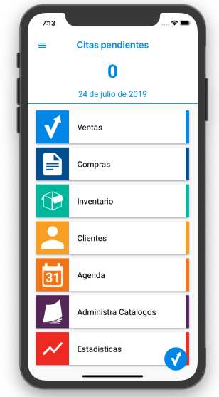
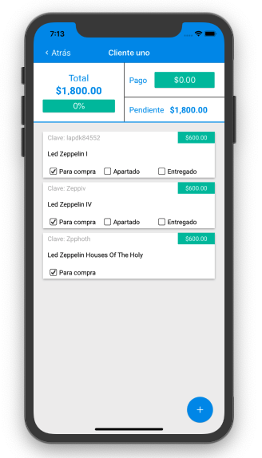
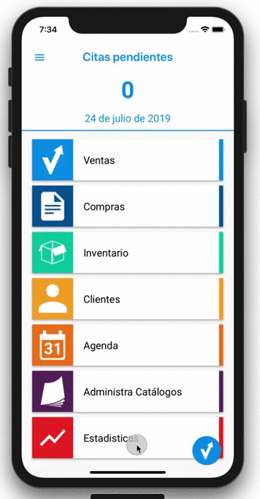

# SIV
SIV es una herramienta para administrar ventas, inventario, compras y clientes en negocios independientes o profecionales de las ventas directas. La aplicación está disponible para [iOS](https://apps.apple.com/mx/app/siv/id1436661624) y [Android](https://play.google.com/store/apps/details?id=com.siis.siv). La aplicación está desarrollada para soportar modo offline y modo online, cobros de suscripción mensual, envio de SMS con detalles de las ventas realizadas, generar tickets de venta en PDF, leer códigos de barras a travez de la camara de los dispositivos y recibir notificaciones push de las actulizaciones de los catálogos que maneja la app.

Mi papel en este proyecto es como el único desarrollador iOS y Android, desde el comienzo del desarrollo hasta la primera vesión de la app. 

Las tecnologías usadas en iOS son: Swift, Firebase, Apple Subscriptions
Las tecnologías usadas en Android son: Java, XML, Firebase, OpenPay, Kotlin

&nbsp;&nbsp;&nbsp;&nbsp;&nbsp;&nbsp;&nbsp;&nbsp;&nbsp;&nbsp;

